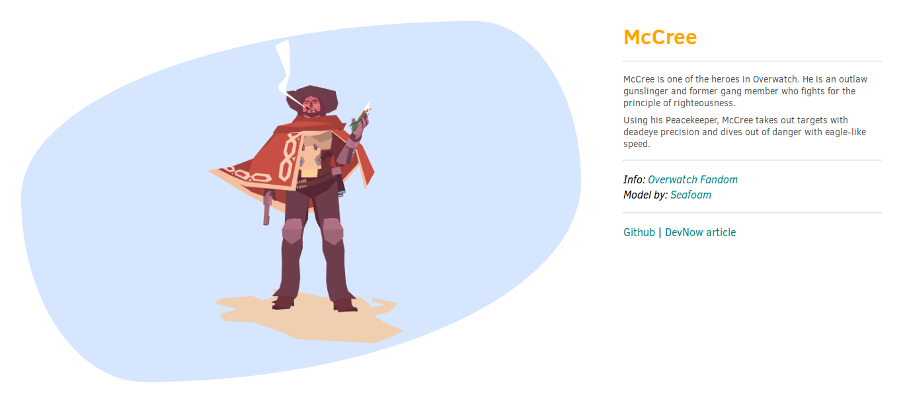

# Vọc cùng Thành #5 - Load 3D model bằng Three.js

## Giới thiệu



Đây là project demo cho bài viết [Vọc cùng Thành #5 - Load 3D model bằng Three.js](https://devnow.vn/voc-cung-thanh-5-load-3d-model-bang-three-js.html)

Demo: https://vct-5-load-3d-model.now.sh/

## Cài đặt

```bash
# clone repo về máy
git clone https://github.com/EGANY-Team/vct-5-load-3d-model

# cài đặt package
cd vct-5-load-3d-model
npm install

# chạy dev http://localhost:8080
npm start

# build
npm run build
```
